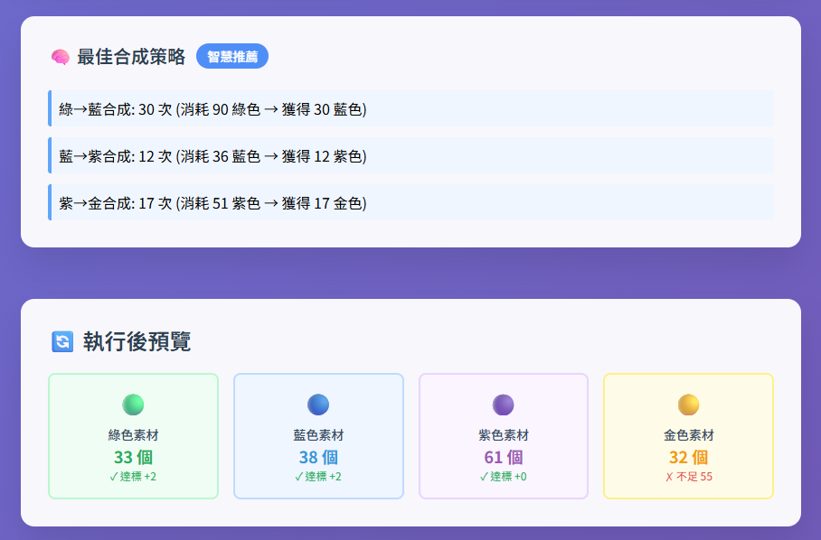

# 🎮 Sid的鳴潮智慧素材需求計算器  
**Sid's Smart Resource Calculator for Wuthering Waves**

升級不再瞎猜！這是一款專為《鳴潮》玩家打造的智慧型網頁工具，能快速計算角色、武器、技能養成所需素材，並提供最佳合成策略與體力消耗規劃。  
Stop guessing your upgrade costs! This smart web tool helps Wuthering Waves players calculate all materials needed for character, weapon, and skill progression—with optimal synthesis paths and stamina planning.

🔗 [立即試用 Try it now](https://sid-1996.github.io/WutheringWaves-Resource-Calculator/)｜免安裝、開網頁就能用 No install needed—just open and use!

---

## 🚀 功能亮點 | Features
- 計算角色技能升級與武器突破所需素材  
  Calculate materials for skill upgrades and weapon ascension  
- 一鍵設定技能等級（如 6、8、10 級）  
  Quick level presets for skills (e.g. Lv.6, Lv.8, Lv.10)  
- 支援武器等級 1~90 的突破需求  
  Supports weapon ascension from Lv.1 to Lv.90  
- 自動生成最佳合成策略（綠 → 藍 → 紫 → 金）  
  Auto synthesis strategy (Green → Blue → Purple → Gold)  
- 避免素材過度消耗，最大化資源利用  
  Prevents overuse of low-tier materials  
- 計算副本場次與體力消耗  
  Calculates stamina cost and dungeon runs  
- 一鍵複製詳細報告，方便分享與記錄  
  One-click copy of full report for sharing  
- 現代化 UI 設計，操作直覺、視覺清爽  
  Clean modern UI for smooth user experience  

---

## 📂 專案檔案結構 | Project Files
- `index.html` → 主程式，包含 HTML、CSS、JavaScript  
  Main app file with embedded HTML, CSS, and JS  
- `README.md` → 說明文件（你現在看到的這份內容）  
  This documentation file  

---

## 💻 使用方式 | How to Use
- 雙擊 `index.html` 即可在瀏覽器中執行  
  Open `index.html` directly in your browser  
- 或使用 👉 [線上版 Online Version](https://sid-1996.github.io/WutheringWaves-Resource-Calculator/)

---

## 📖 操作說明 | Instructions
1. 選擇角色技能與武器突破等級  
   Select skill and weapon levels  
2. 輸入你目前擁有的素材數量  
   Input your current material inventory  
3. 系統即時顯示素材缺口、合成建議與體力規劃  
   Tool shows material gaps, synthesis plan, and stamina needs  
4. 點擊「複製報告」即可快速分享或記錄結果  
   Click “Copy Report” to share or save results  

---

## 🗣️ 社群推薦 | Community Feedback
想看實際使用流程與心得？巴哈姆特玩家已分享詳細教學與圖文示範：  
👉 [【密技】鳴潮智慧素材需求計算器（武器與技能素材合成）@巴哈姆特](https://forum.gamer.com.tw/C.php?bsn=74934&snA=12466&page=1&gothis=92972#92972)

---

## 🖼️ 工具畫面預覽 | Screenshots
  

---

## 🛠 技術說明 | Tech Stack
- 前端技術：HTML + CSS + JavaScript  
  Frontend: HTML + CSS + JavaScript  
- UI 框架：TailwindCSS  
  UI Framework: TailwindCSS  
- 字型設計：Noto Sans TC（Google Fonts）  
  Font: Noto Sans TC via Google Fonts  

---

## 📜 授權條款 | License
本工具僅供學習與遊戲愛好者交流使用，禁止商業用途。  
This tool is for educational and fan-use only. Commercial use is prohibited.

---

## ☕ 支持作者
- [💚 綠界科技贊助（支持作者）](https://p.ecpay.com.tw/E0E3A)  
- [☕ Buy Me a Coffee](https://www.paypal.com/ncp/payment/ARWX3ZS893UKU)  
- [🔗 Support This Project](https://www.paypal.com/ncp/payment/4YCFVARX3ADGW](https://www.paypal.com/ncp/payment/GJS4D5VTSVWG4))  

感謝每一位支持者！💖
